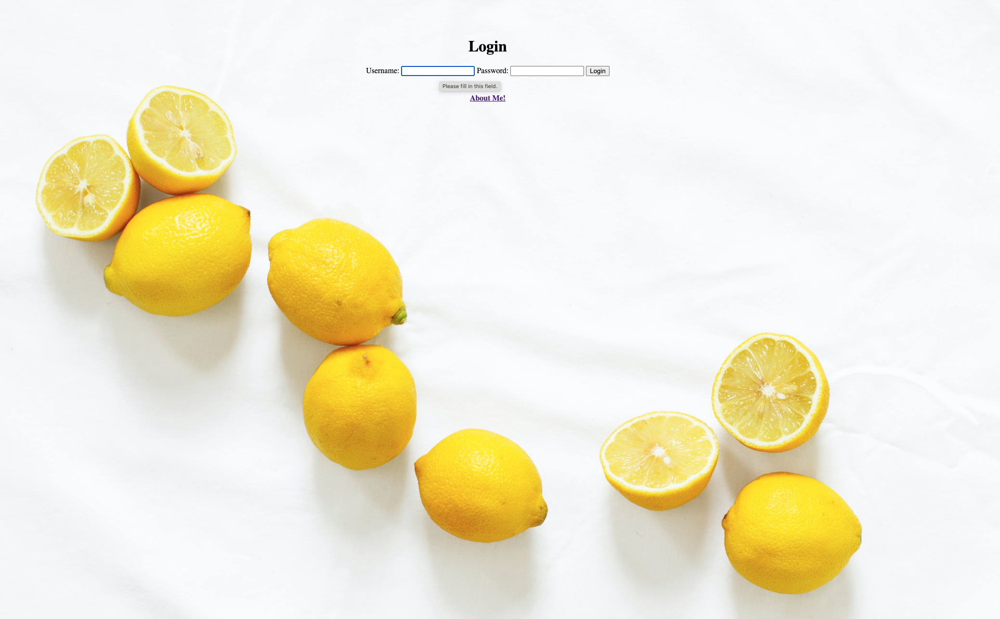

# Recipe-App

This is a basic recipe app built with Django and hosted on Heroku. It is plugged into a SQL database and works in the browser. The focus for this project was on Django and as such, only very basic styling has been applied.

In this app, the user is able to:
  - login 
  - view information about a recipe (including name, an image, description of recipe, ingredients and difficulty)
  - search for a recipe according to name or ingredient 
  - view a bar, pie or line graph related to what recipe name or ingredient has been search

  

 # Build with:
 - HTML
 - Python 3
 - Django
 - Pandas

 # More information
 - login with 'username' and 'recipes123' as password
 - project link: https://calm-wildwood-92057-b3369e970ef8.herokuapp.com/
 